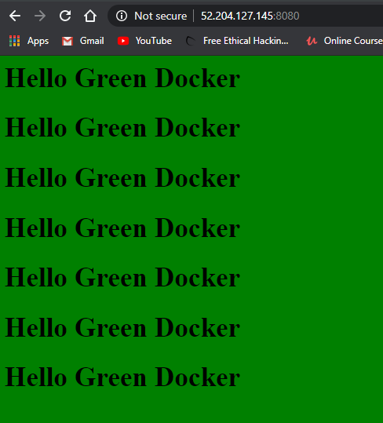

# Question 3

#### To run the container use

```
docker run -d --name rhythmc3q3 -p 8080:80 dockerashu/ckad:v2
```

#### Accessing using

```
http://52.204.127.145:8080/
```

### Number of time "Docker" is shown: 14

#### Output


